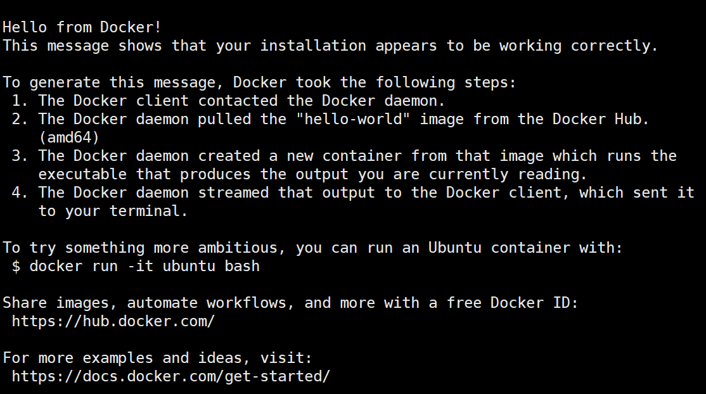
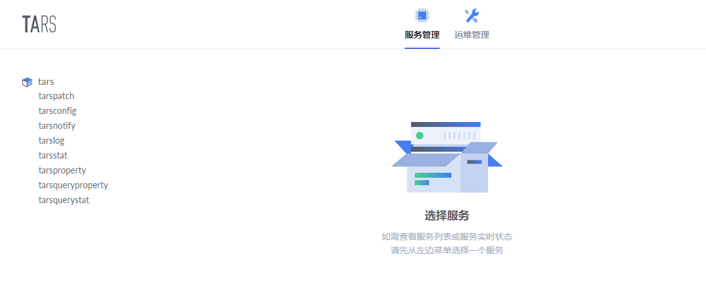
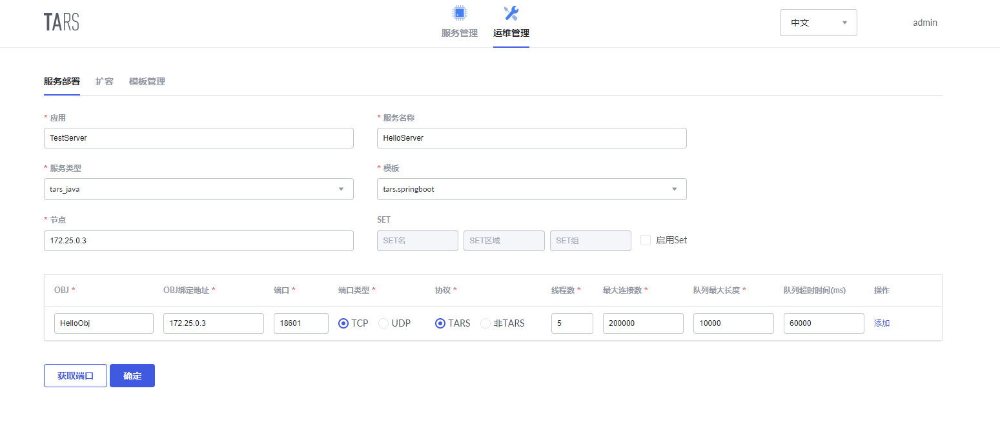
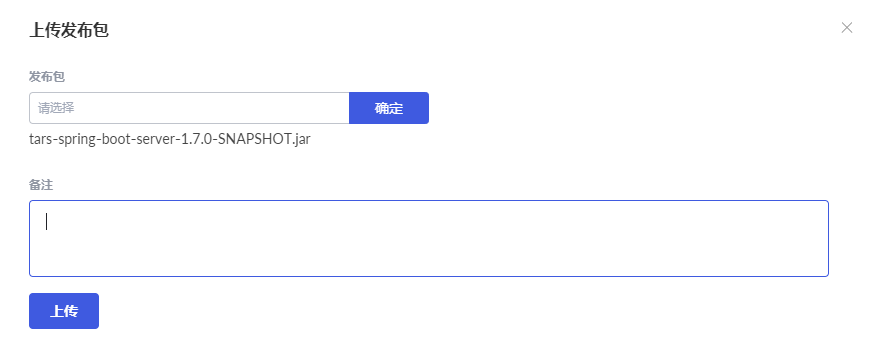
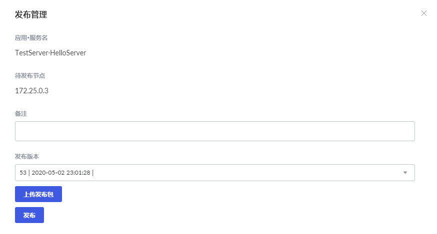
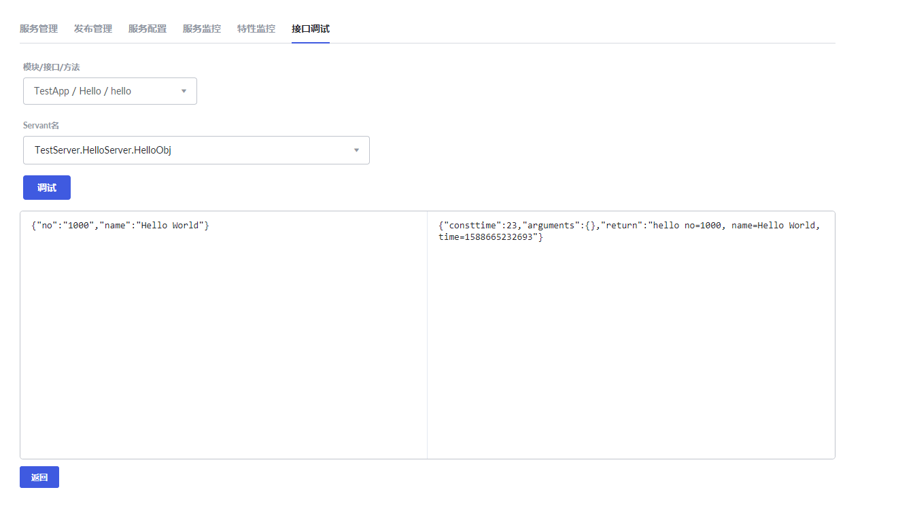

# Tars服务端快速入门


## Docker部署Tars
### 安装Docker
ubuntu上安装docker流程如下：

**1. 更新包索引**

```text
sudo apt-get update
```

**2. 允许通过https安装**

```
sudo apt-get install  apt-transport-https  ca-certificates curl  software-properties-common
```

**3. 添加Docker官方的GPG密钥：**

```
curl -fsSL  https://download.docker.com/linux/ubuntu/gpg | sudo apt-key add
```

国内用户可使用腾讯云源：

```text
curl -fsSL https://mirrors.cloud.tencent.com/docker-ce/linux/ubuntu/gpg | sudo apt-key add -
```

**4. 设置版本库类型**

```
sudo add-apt-repository "deb [arch=amd64]  https://download.docker.com/linux/ubuntu $(lsb_release -cs) stable" 
```

国内用户可使用腾讯云源：

```text
sudo add-apt-repository "deb [arch=amd64] https://mirrors.cloud.tencent.com/docker-ce/linux/ubuntu $(lsb_release -cs) stable" 
```

**5. 再次更新包索引**

```text
sudo apt-get update
```

**6. 安装docker-ce** 

```
sudo apt-get install docker-ce
```

**7. 测试是否安装成功** 

```
docker run hello-world
```



出现如上界面表示docker安装成功。


### 部署Tars

**1. 创建Docker虚拟网络**

```text
# 创建一个名为tars的桥接(bridge)虚拟网络，网关172.25.0.1，网段为172.25.0.0
docker network create -d bridge --subnet=172.25.0.0/16 --gateway=172.25.0.1 tars
```

**2. Docker中启动MySQL**

```text
docker run -d \
    --net=tars \
    -e MYSQL_ROOT_PASSWORD="123456" \
    --ip="172.25.0.2" \
    -v /data/framework-mysql:/var/lib/mysql \
    -v /etc/localtime:/etc/localtime \
    --name=tars-mysql \
    mysql:5.6
```

**3. 使用tarscloud/tars:java部署**

拉取容器镜像：

```text
docker pull tarscloud/tars:java
```

启动容器：

```text
docker run -d -it --name tars_java \
    --net=tars \
    --env DBIP=172.25.0.2 \
    --env DBPort=3306 \
    --env DBUser=root \
    --env DBPassword=123456 \
    -e INET=eth0 \
    --ip="172.25.0.3" \
    -p 3000:3000 \
    -p 18600-18700:18600-18700 \
    -v /data/tars_data:/data \
    tarscloud/tars:java
```

**注意：-p 18600-18700:18600-18700参数开放了 18600-18700 端口供应用使用，不够可自行添加。**


容器启动后， 访问 `http://${你的机器IP}:3000` 即可打开 web 管理平台，界面如下：




## 服务端开发

### 环境需求

- JDK 1.8或以上版本
- Maven 2.2.1或以上版本
- Spring Boot 2.0或以上版本


### 工程目录

```text
├── pom.xml
└── src
   └── main
       ├── java
       │   └── tars
       │       └── testapp
       │          ├── HelloServant.java
       │          ├── QuickStartApplication.java
       │          └── impl
       │                └── HelloServantImpl.java
       └── resources
           └── hello.tars
       
```


### 依赖配置

在pom.xml文件中需要添加如下配置:

**spring boot及框架依赖**

```xml
    <properties>
        <spring-boot.version>2.0.3.RELEASE</spring-boot.version>
    </properties>

    <dependencyManagement>
        <dependencies>
            <dependency>
                <groupId>org.springframework.boot</groupId>
                <artifactId>spring-boot-dependencies</artifactId>
                <version>${spring-boot.version}</version>
                <type>pom</type>
                <scope>import</scope>
            </dependency>
        </dependencies>
    </dependencyManagement>

    <dependencies>
        <dependency>
            <groupId>com.tencent.tars</groupId>
            <artifactId>tars-spring-boot-starter</artifactId>
            <version>1.7.0</version>
        </dependency>
    </dependencies>
```

**插件依赖**

```xml
<!--tars2java插件-->
<plugin>
	<groupId>com.tencent.tars</groupId>
	<artifactId>tars-maven-plugin</artifactId>
	<version>1.7.0</version>
	<configuration>
		<tars2JavaConfig>
			<!-- tars文件位置 -->
			<tarsFiles>
				<tarsFile>${basedir}/src/main/resources/hello.tars</tarsFile>
			</tarsFiles>
			<!-- 源文件编码 -->
			<tarsFileCharset>UTF-8</tarsFileCharset>
			<!-- 生成服务端代码 -->
			<servant>true</servant>
			<!-- 生成源代码编码 -->
			<charset>UTF-8</charset>
			<!-- 生成的源代码目录 -->
			<srcPath>${basedir}/src/main/java</srcPath>
			<!-- 生成源代码包前缀 -->
			<packagePrefixName>com.qq.tars.quickstart.server.</packagePrefixName>
		</tars2JavaConfig>
	</configuration>
</plugin>
<!--打包插件-->
<plugin>
    <groupId>org.apache.maven.plugins</groupId>
    <artifactId>maven-jar-plugin</artifactId>
     <version>2.6</version>
     <configuration>
         <archive>
             <manifestEntries>
                 <Class-Path>conf/</Class-Path>
             </manifestEntries>
          </archive>
     </configuration>
</plugin>
<plugin>
    <groupId>org.springframework.boot</groupId>
    <artifactId>spring-boot-maven-plugin</artifactId>
    <configuration>
        <!--设置打包主类-->
        <mainClass>com.qq.tars.quickstart.server.QuickStartApplication</mainClass>
    </configuration>
    <executions>
        <execution>
            <goals>
                <goal>repackage</goal>
             </goals>
     </executions>
</plugin>
```


### 服务开发

#### Tars接口文件定义

在resources目录下新建hello.tars文件，内容如下：

```text
module TestApp
{
	interface Hello
	{
	    string hello(int no, string name);
	};
};
```

#### 使用插件生成接口代码

在工程根目录下，执行mvn tars:tars2java，即可得到HelloServant.java，内容如下：

```java
@Servant
public interface HelloServant {

	public String hello(int no, String name);
}
```

#### 实现接口

新建HelloServantImpl.java文件，实现HelloServant.java接口，并通过@TarsServant注解来暴露服务，其中HelloObj为servant名称，与web管理平台中的名称对应。

```java
@TarsServant("HelloObj")
public class HelloServantImpl implements HelloServant {

    @Override
    public String hello(int no, String name) {
        return String.format("hello no=%s, name=%s, time=%s", no, name, System.currentTimeMillis());
    }
}
```

#### 开启Tars服务

在Spring Boot启动类QuickStartApplication中添加@EnableTarsServer注解来开启Tars服务：

```java
@SpringBootApplication
@EnableTarsServer
public class QuickStartApplication {
    public static void main(String[] args) {
        SpringApplication.run(QuickStartApplication.class, args);
    }
}
```

#### 服务打包

通过spring-boot-maven-plugin，在根目录下执行mvn package即可打包为jar包。


## 服务发布

### 服务部署



如上图进行配置，一些参数如下：

- 应用名：表示一组服务的集合
- 服务名称：提供服务的进程名称
- OBJ：提供具体服务的接口

系统通过应用名+服务名称+OBJ来定义服务在系统中的路由名称，例如TestServer.HelloServer.HelloObj

- 服务类型：tars_java
- 模板：tars.springboot
- 节点：选择启动的Tars节点IP
- 端口：选择对外开放的端口


### 发布节点

服务部署成功后，刷新主页面可以看到新增的服务：


选择该服务，进入发布管理，选中需要发布的节点，点击发布选中节点：


点击上传发布包，并把jar包上传：



上传完成后，会自动生成一个带有时间戳的版本号，选择该版本，点击发布：



发布成功后，回到服务管理界面可以看到状态为Active，即表示成功：


### 接口调试

进入接口调试界面，点击添加，并上传resources目录下的hello.tars文件：


上传完成后，在tars文件列表中会显示新增的服务，点击调试：


选择需要调试的方法，并输入入参，点击调试，即可获得方法出参：



至此服务端部署完毕。