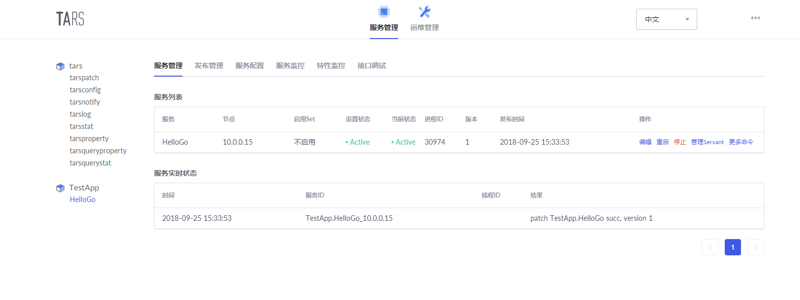

# Hello World

## 管理系

用户登录成功后，会进入Tars管理系统，如下图

TARS管理系统的菜单树下，有以下功能：

* 业务管理：包括已部署的服务，以及服务管理、发布管理、服务配置、服务监控、特性监控等；
* 运维管理：包括服务部署、扩容、模版管理等；

## 服务命名

使用Tars框架的服务，其的服务名称有三个部分：

* APP：应用名，标识一组服务的一个小集合，在Tars系统中，应用名必须唯一。例如：TestApp；
* Server：服务名，提供服务的进程名称，Server名字根据业务服务功能命名，一般命名为：XXServer，例如HelloServer；
* Servant：服务者，提供具体服务的接口或实例。例如:HelloObj；

说明：

- 一个Server可以包含多个Servant，系统会使用服务的App + Server + Servant，进行组合，来定义服务在系统中的路由名称，称为路由Obj，其名称在整个系统中必须是唯一的，以便在对外服务时，能唯一标识自身。
- 每个Servant对应一个独立的端口, 对外服务.
- 因此在定义APP时，需要注意APP的唯一性。

例如：TestApp.HelloServer.HelloObj。

## 服务部署

服务部署，其实也可以在服务开发后进行，不过建议先做。

点击主菜单“运维管理”-&gt;“服务部署”，如下图：

* “应用”指你的服务程序归在哪一个应用下，例如：“TestApp”。 
* “服务名称”指你的服务程序的标识名字，例如：“HelloServer”。 
* “服务类型”指你的服务程序用什么语言写的，例如：java的选择“tars\_java”。 
* “模版“ 指你的服务程序在启动时，设置的配置文件的名称
* “节点“ 指服务部署的机器IP。 
* “Set分组“ 指设置服务的Set分组信息，Set信息包括3部分：Set名、Set地区、Set组名。 
* “OBJ名称“ 指Servant的名称。 -“OBJ绑定IP“ 指服务绑定的机器IP，一般与节点一样。 
* “端口“ 指OBJ要绑定的端口。 
* “端口类型“ 指使用TCP还是UDP。 
* “协议“ 指应用层使用的通信协议，Tars框架默认使用tars协议。 
* “线程数“ 指业务处理线程的数目。 
* “最大连接数“ 指支持的最大连接数。 
* “队列最大长度“ 指请求接收队列的大小。 
* “队列超时时间“ 指请求接收队列的超时时间。

点击“提交“，成功后，菜单数下的TestApp应用将出现HelloServer名称，同时将在右侧看到你新增的服务程序信息，如下图：

在管理系统上的部署暂时先到这里，到此为止，只是使你的服务在管理系统上占了个位置，真实程序尚未发布。

## 服务发布

在管理系统的菜单树下，找到你部署的服务，点击进入服务页面。

选择“发布管理”，选中要发布的节点，点击“发布选中节点”，点击“上传发布包”，选择已经编译好的发布包，如下图：

上传好发布包后，点击“选择发布版本”下拉框就会出现你上传的服务程序，选择最上面的一个（最新上传的）。

点击“发布”，服务开始发布，发布成功后，出现下面的界面，如下图：

若失败的话，可能是命名问题，上传问题，以及其他环境问题。欢迎开启Issue进行讨论。

