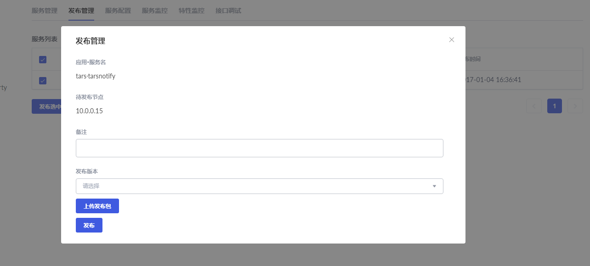
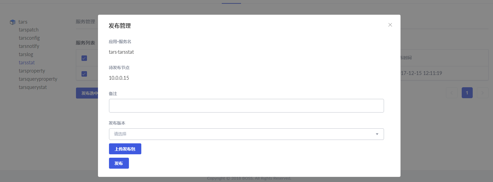
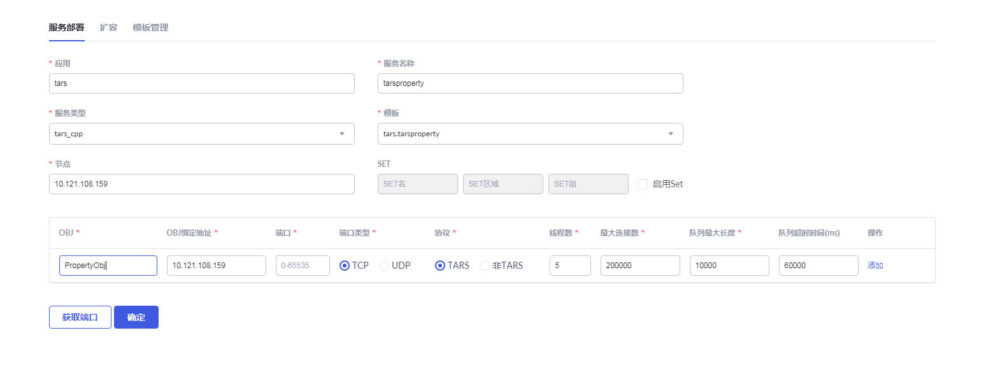
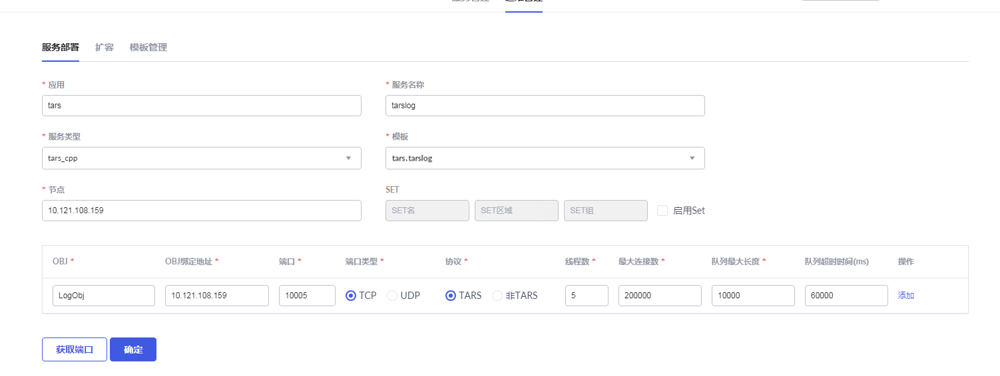
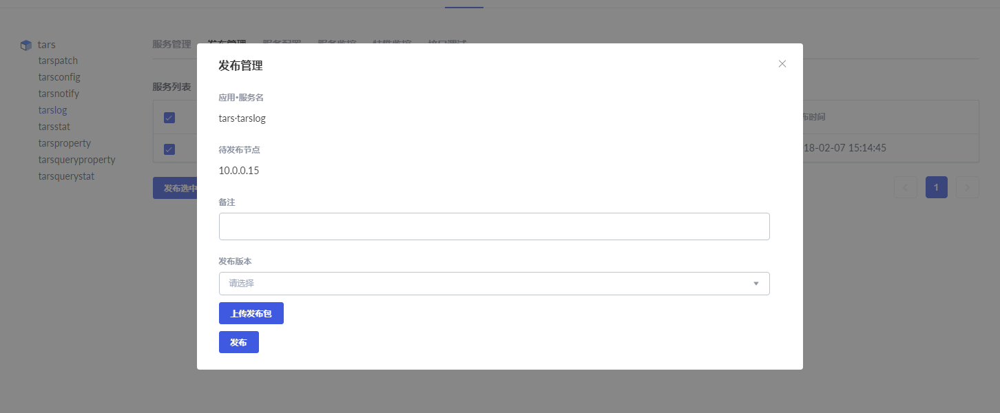
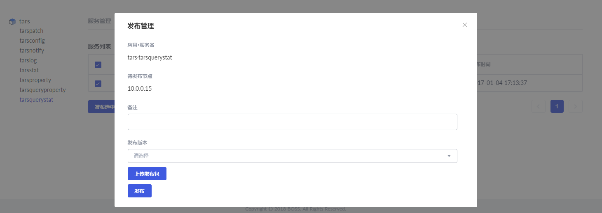
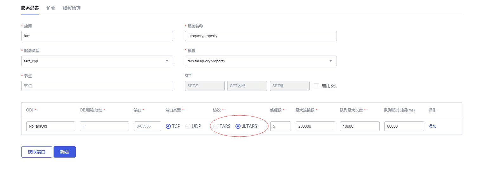

# 目录
> * [依赖环境](#chapter-1)
> * [Tars C++开发环境](#chapter-2)
> * [Tars框架安装](#chapter-3)
> * [Tars-web说明](#chapter-4)
> * [框架扩容及更新](#chapter-5)

## 1 介绍

当我们谈到框架的扩容和更新时, 主要讨论的内容包括:
- 框架核心服务如何扩容到多台机器上
- 如果新增节点服务器
- tarsweb如何更新
- 框架各个核心服务如何更新到最新版本

## 2 框架服务扩容

框架服务的扩容会随着部署方式的不同而不同:

### 2.1 一键脚本部署

使用linux-install.sh安装的框架, 如果需要扩容一台机器时, 可以在新的机器上重新执行linux-install.sh即可

**注意: 务必不要设置REBUILD为true, 数据库会被重置!!!**

### 2.2 docker部署

以docker形式安装的框架, 可以通过docker整体更新的方式来操作, 只需要升级docker, 重启即可

**注意: 务必不要设置REBUILD为true, 数据库会被重置!!!**

- 通过源码编译的方式使用linux-install.sh安装的框架, 可以重新执行linux-install.sh即可(注意: 务必不要设置REBUILD为true, 数据库会被重置!!!)
- tarsnode的扩容和更新可以在web平台(>=1.3.1)上在线安装和更新tarsnode

**如果需要手工更新, 可以参考以下章节, 手工更新各个模块**

## 3 tarsnode安装和更新

核心基础服务的安装成功后，如果需要在其他机器也能部署基于tars框架的服务，那么在通过管理平台扩容和部署服务前，需要在其他节点机上安装tarsnode并连接到框架上。

如果只是在一台机器部署服务进行测试，这一步可以先忽略，等到需要扩容时再执行。

具体步骤跟上一节很像，如下：

创建基础服务的部署目录，如下：
```  shell
cd /usr/local/app
mkdir tars
chown ${普通用户}:${普通用户} ./tars/
```

将主节点上的tarsnode copy到/usr/local/app/tars/

修改/usr/local/app/tars/tarsnode/conf/tars.tarsnode.config.conf

将localip换成自己的本机ip即可

同时将registry的ip换成TarsFramework框架的ip(可以是多个), 例如:
```
locator=tars.tarsregistry.QueryObj@tcp -h xxx2 -p 17890:tcp -h xxx2 -p 17890
```

然后执行脚本，启动tarsnode:
```
/usr/local/app/tars/tarsnode/util/start.sh
```

在crontab配置一个进程监控，确保TARS框架服务在出现异常后能够重新启动。
```
* * * * * /usr/local/app/tars/tarsnode/util/monitor.sh
```

**注意:之前安装的框架的服务器, 如果用check.sh做了监控, 则无需再配置tarsnode的监控了**

## 5.3 Tar-web更新

**更新步骤**
- 下载最新的Tars-web的代码, 覆盖 /usr/local/app/web
- 修改web配置文件: web/config/webConf.js, web/config/tars.conf, 修改db的ip为当前mysql ip, 修改tars的ip为当前环境的registry的ip
- 修改demo配置文件: web/demo/config/webConf.js, 修改dbip为当前环境的mysql ip
- 修改web配置文件: web/config/webConf.js, 修改host为当前主机ip

- cd web; npm install; cd demo; npm install
- 重启模块: pm2 restart tars-node-web; pm2 restart tars-user-system

**如果数据库中不存在db_tars_web 和 db_user_system, 请先创建db(web/sql/db_tars_web.sql, web/demo/sql/db_user_system.sql)**

```
mysql -hxxx -pxxx -e 'create database db_tars_web'
mysql -hxxx -pxxx db_tars_web < web/sql/db_tars_web.sql

mysql -hxxx -pxxx -e 'create database db_user_system'
mysql -hxxx -pxxx db_user_system < web/demo/sql/db_user_system.sql

```

## 5.4 框架基础服务更新

框架服务的安装分两种：

一种是核心基础服务(必须的)，必须手工部署的，
```
手工部署的核心基础服务：tarsAdminRegistry, tarsregistry, tarsnode, tarsconfig, tarspatch

可以手工出安装包(但是不能通过管理平台发布)

make tarsAdminRegistry-tar
make tarsregistry-tar
make tarsconfig-tar
make tarspatch-tar
```
上述包的更新, 比如上传到对应服务, 解压以后, 覆盖bin目录下的可执行程序, 比如更新tarsregistry:
```
tar xzf tarsregistry.tgz
cp -rf tarsregistry/bin/tarsregistry /usr/local/app/tars/tarsregistry/bin/tarsregistry
/usr/local/app/tars/tarsregistry/bin/util/start.sh
```

一种是普通基础服务(可选的)，可以通过管理平台发布的(和普通服务一样）。

```
通过管理平台部署的普通基础服务：tarsstat, tarsproperty,tarsnotify, tarslog，tarsquerystat，tarsqueryproperty

手工出包以后, 通过管理平台来发布

make tarsstat-tar
make tarsnotify-tar
make tarsproperty-tar
make tarslog-tar
make tarsquerystat-tar
make tarsqueryproperty-tar
```
具体参见5.5章节。

**注意在管理平台进行部署时，选择正确的服务模板即可（默认是有的，若没有相应的模版，可以在管理平台上创建，具体服务的模版内容可以参见源码目录deploy/sql/template目录下的文件）!**

## 5.5. 基础服务手工上传示意图


在执行上述的make语句后，/usr/local/app/TarsFramework/build就会生成几个*.tgz文件，例如tarslog.tgz, tarsnotify.tgz等等，这些文件就是下面章节中所需要部署的包文件。

### 5.5.1 tarsnotify部署发布

默认tarsnotify在安装核心基础服务时，部署信息已初始化了，安装完管理平台后，就可以看到，如下：


上传发布包后，发布如下：



### 5.5.2 tarsstat部署发布

部署信息如下：


上传发布包后，发布如下：



### 5.5.3 tarsproperty部署发布

部署信息如下：



上传发布包后，发布如下：


### 5.5.4 tarslog部署发布

部署信息如下：



上传发布包后，发布如下：



### 5.5.5 tarsquerystat部署发布

部署信息如下：


**注意在服务部署时，选择非Tars协议，因为Web是以json协议来获取服务监控的数据的**

上传发布包后，发布如下：




### 5.5.6 tarsqueryproperty部署发布

部署信息如下：



**注意在服务部署时，选择非Tars协议，因为Web是以json协议来获取属性监控的数据的**

上传发布包后，发布如下：


最后，在安装环境过程中，如果系统仍有问题，请到以下的目录查找日志文件分析问题所在：
(1) ${TarsWeb}/log  
(2) /usr/local/app/tars/app_log/tars


